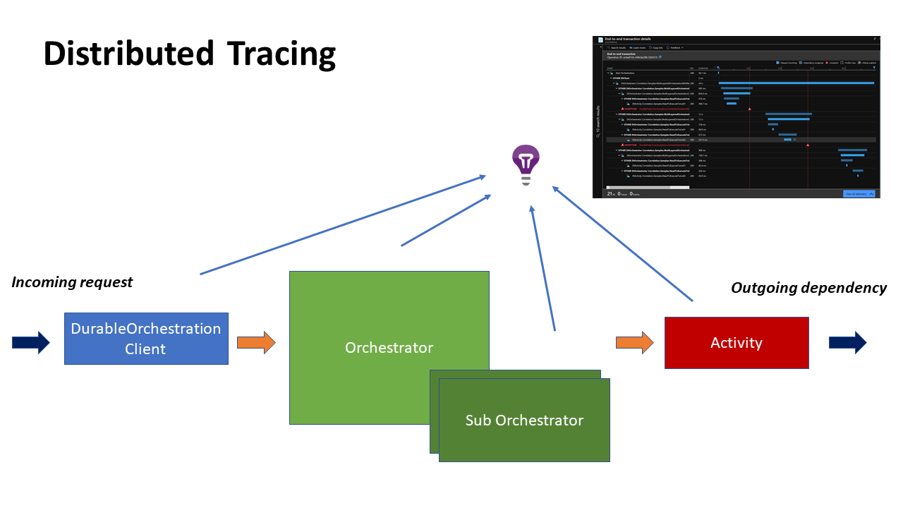
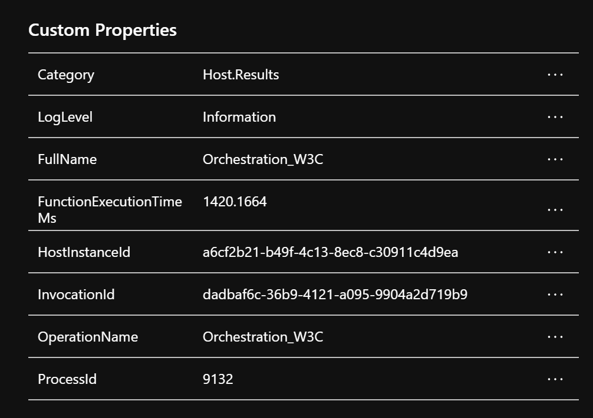

# Distributed Tracing for Durable Functions

It does not only demonstrate how to use the Distributed Tracing but also used for testing, including non-supported orchestrations by the Distributed Tracing. 

## Video: Distributed Tracing for Durable Functions
Overview of the Distributed Tracing

## Video External Correlation
How to correlate with external systems

# Getting Started

* [Getting Started](getting-started.md)

# Configuration 

* [Configuration](configuration.md)

# Reference

* [Reference](reference.md)

# Architecture 

Durable Functions Distributed Tracing is mainly implemented DurableTask library. For more details of the architecture, you can refer [durabletask: Distributed Tracing](https://github.com/Azure/durabletask/tree/correlation/samples/Correlation.Samples).

# Sample Scenario

Refer to the scenario that includes the samples. Some scenarios do not support distributed tracing. We'll support it in the future. For executing samples, call `HttpStart_*` functions as the endpoints. 

| Scenario | Description | Endpoint | Supported | comment |
| ------- | ------------------- | -------- | --------- | ------- |
| Simple Orchestration | A simple Orchestration with an Activity | /api/HttpStart_SimpleOrchestration | yes | |
| Multiple LayerOrchestration With Retry | A complex orchestration that includes sub orchestration, errors, and retry | /api/HttpStart_MultiLayerOrchestrationWithRetry | yes | |
| Correlation integration | Getting a tracing Id from outside of the function, also getting tracing Id in the orchestrator and activity | /api/HttpStart_AnExternalSystem | yes | The endpoint represents an external sytem, it call a function that start an orchestration |
| Fan Out Fan In | Simple [Fan Out/Fan In](https://docs.microsoft.com/en-us/azure/azure-functions/durable/durable-functions-overview?tabs=csharp#fan-in-out) Pattern implementation | /api/HttpStart_FanOutFanIn |
| Durable Entity Orchestration | [Stateful Entities Pattern](https://docs.microsoft.com/en-us/azure/azure-functions/durable/durable-functions-orchestrations?tabs=csharp) implementation | /api/HttpStart_EntityCounter |no | Entity has not supported yet, however, it correlate for the other parts |
| HTTP endpoints | [Calling HTTP endpoints](https://docs.microsoft.com/en-us/azure/azure-functions/durable/durable-functions-orchestrations?tabs=csharp) implementation | /api/HttpStart_HttpEndpoints | no | |
| Human Interaction | [Human Interaction](https://docs.microsoft.com/en-us/azure/azure-functions/durable/durable-functions-overview?tabs=csharp#human) pattern implementation | /api/HttpStart_ExternalEvent | no | After staring the orchestration, call /api/ApprovalOne and /api/ApprovalTwo with `{"Message": "Approved!" , "InstanceId":"<YOUR_INSTANCE_ID>"}` with POST |
| ContinueAsNew | [Eternal Orchestrator](https://docs.microsoft.com/en-us/azure/azure-functions/durable/durable-functions-eternal-orchestrations?tabs=csharp) implementation| /api/HttpStart_ExternalOrchestrations | yes |  |
| Monitoring | [Monitor ](https://docs.microsoft.com/en-us/azure/azure-functions/durable/durable-functions-overview?tabs=csharp#monitoring) Pattern implementation | /api/HttpStart_Monitor?JobId={JobId} | no | You can see all the telemetries on the End to End transaction as the same Operation ID telemetry. However, the parent-children relationship sometimes missing. |

# Limitation

Current version doesn't include the custom properties of a telemetry of the Application Insights. 

The custom property is available for ActivityTrigger once this pull request is accepted and a change added to the Durable Functions side.
[Track original activity at the Application Insights Logger](https://github.com/Azure/azure-webjobs-sdk/pull/2474)

# FAQ

### 1. In some supported Scenario, the correlation relationship looks broken

The Distributed Tracing system track the Orchestration Request Telemetry after the completion of the orchestrator. Wait for a while, then look at the telemetry again. 

