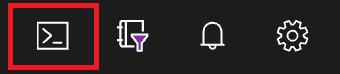
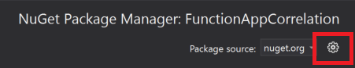
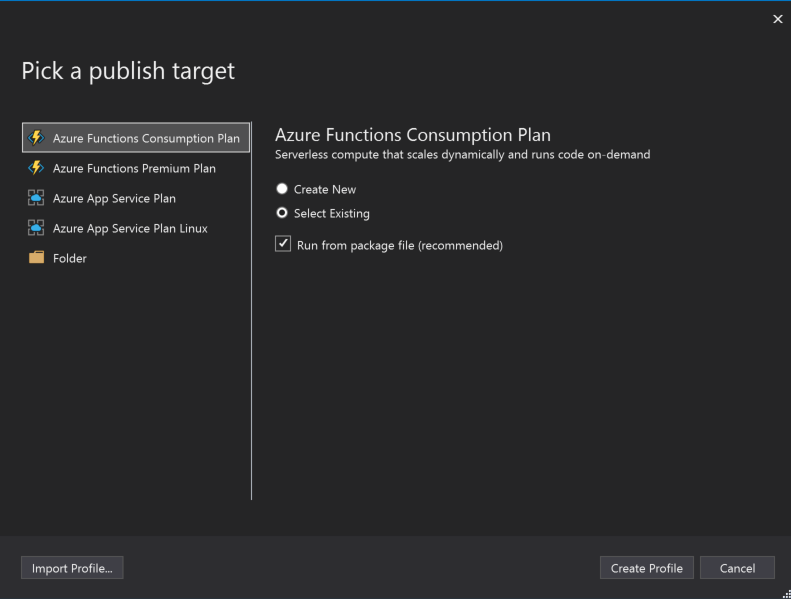
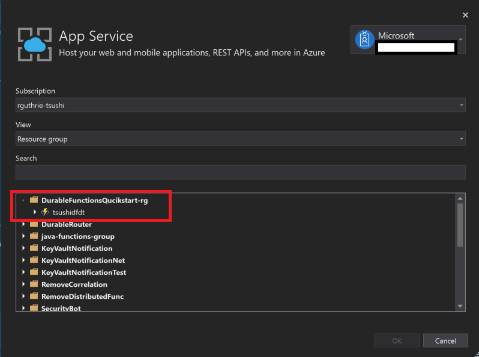
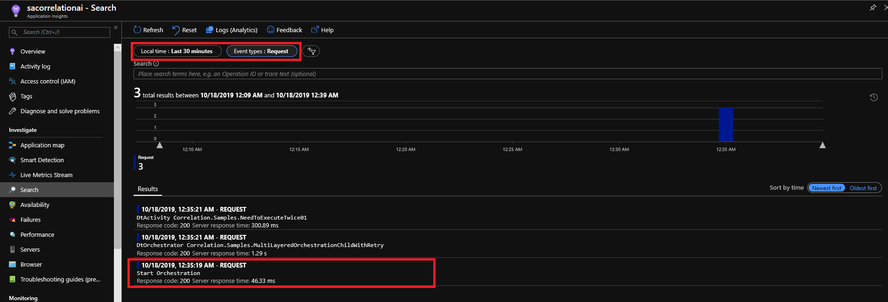
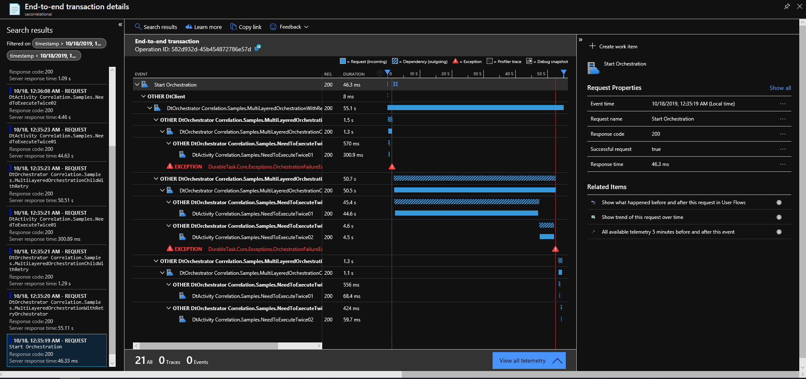

# Getting Started for Distributed Tracing for Durable Functions

In this article, you use command-line tools to create a function app, then publish the sample applications using Visual Studio then learn how to diagnose the telemetry. In this tutorial, we use Azure CLI on the Cloud Shell to create an environment. 

* An Azure account with an active subscription. [Create an account for free](https://azure.microsoft.com/free/?ref=microsoft.com&utm_source=microsoft.com&utm_medium=docs&utm_campaign=visualstudio)
* Visual Studio 2019. Ensure you select the Azure Development workload during installation. For more details [Quickstart: Create your first function in Azure using Visual Studio](https://docs.microsoft.com/en-us/azure/azure-functions/functions-create-your-first-function-visual-studio)


# Create a function app

Go to Azure Portal, Click the cloud shell on the right top of the Azure Portal. Open Bash.



## Create a Resource Group

Create a resource group.

```bash
ResourceGroup=DurableFunctionsQucikstart-rg
Location=westus
az group create --name $ResourceGroup --location $Location
```
## Create a Storage Account

Create a storage account. The storage account name should be globally unique. 

```bash
StorageAccountName=<STORAGE_NAME>
az storage account create --name $StorageAccountName --location $Location --resource-group $ResourceGroup --sku Standard_LRS
```

## Create an Application Insights
FunctionAppName should be globally unique. 

```bash
az extension add -n application-insights
FunctionAppName=<FUNCION_APP_NAME>
InstrumentationKey=`az monitor app-insights component create --app $FunctionAppName --location $Location --kind web -g $ResourceGroup --application-type web |  jq .instrumentationKey | xargs`
```

You can see your InstrumentationKey of the Application Insights. We'll use this key at the configuration part of the sample applications. 

```bash
echo $InstrumentationKey
```

## Create a Function App


```bash
az functionapp create --resource-group $ResourceGroup --consumption-plan-location $Location --runtime dotnet --functions-version 3 --name $FunctionAppName --storage-account $StorageAccountName  --app-insights $FunctionAppName --app-insights-key $InstrumentationKey
```

**NOTE:** The samples targeting functions version 3. Distributed Tracing works for version 2 but not for version 1. 

# Publish samples 

```bash
git clone git@github.com:Azure/azure-functions-durable-extension.git
cd azure-functions-durable-extension
git switch -c correlation origin/correlation
```

## Open the .sln file

Go to `samples/correlation-csharp/` then open FunctionAppCorrelation.sln with Visual Studio 2019. 

## Create a local.settings.json

Create your `local.settings.json` for local execution. 
You can copy and modify `local.settings.json.example.` Set the Application Insights Key. If you are not familiar with the Application Insights key, refer to [Create an Application Insights resource](https://docs.microsoft.com/en-us/azure/azure-monitor/app/create-new-resource). 

```json
{
  "IsEncrypted": false,
  "Values": {
    "AzureWebJobsStorage": "UseDevelopmentStorage=true",
    "FUNCTIONS_WORKER_RUNTIME": "dotnet",
    "APPINSIGHTS_INSTRUMENTATIONKEY": "<YOUR_APPINSGITHS_INSTRUMENTATIONKEY_HERE>"
  }
}
```

## host.json

Configure host.json. This JSON is the sample of the Distributed Tracing with the W3C trace context. Distributed Tracing is enabled by default. You need to configure the telemetry protocol. For more details, refer [reference](reference.md).

```json
{
  "extensions": {
    "durableTask": {
      "tracing": {
        "DistributedTracingProtocol": "W3CTraceContext"
      }
    }
  },
  "logging": {
    "applicationInsights": {
      "httpAutoCollectionOptions": {
        "enableW3CDistributedTracing": true
      } 
    }
  },
  "version": "2.0"
}
```

## Storage Emulator 
For the local execution, you need the [Strorage Emulator](https://docs.microsoft.com/en-us/azure/storage/common/storage-use-emulator). Download it from the link and execute it before you run the functions. 

## Configure NuGet 

Goto the Package source on Visual Studio. Right-click FunctionAppCorrelation project, select `Manage NuGet packages...`, then click the icon. 



Add Available package sources. 
NOTE: Distributed Tracing is pre-release. We currently use myget.org until it is going to GA. 

Name: azure-appservice-staging
Source: https://www.myget.org/F/azure-appservice-staging/api/v3/index.json

During pre-release, we use `Microsoft.Azure.WebJobs.Extensions.DurableTask.Telemetry` NuGet package start with Version `2.2.0-alpha`.

## Push the samples to the Function App

Right-click the `FunctionAppCorrelation` project, then select `Publish.`  

Pick a publish target will be `Azure Functions Consumption Plan` with Select Existing with Run from package file. Click `Create Profile`



Then select the target function app. Then click `OK.`



## Run the samples

Refer to [the scenario](Readme.md#sample-scenario) that includes the samples. Some scenarios do not support distributed tracing. We'll support it in the future. For executing samples, call `HttpStart_*` functions as the endpoints. 

If you can't pick one, you can try `/api/HttpStart_sampleOrchestration` on your FunctionApp. For the complex orchestration, try `/api/HttpStart_MultiLayerOrchestrationWithRetry`

Refer the [Sample scenario](Readme.md#sample-scenario).

## Diagnose the Telemetry

Go to your Azure Portal, then go to your Application Insights resource. 
Click `Search` on your left list. Filter it with `Last 30 minutes` and `Event types: Request.` You can see the `Start Orchestration` request. Click it.



Then You can see end-to-end tracing. Click and see how it correlates with each other. 



**NOTE:** When you see the correlation breaks, you might wait for a while. The request telemetry of the first orchestrator comes last. 

# Next Steps

* [Configuration](configuration.md)
* [Reference](reference.md)


