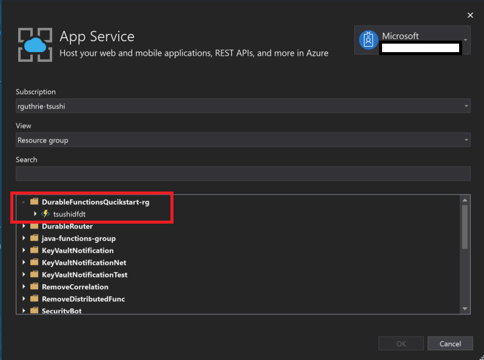
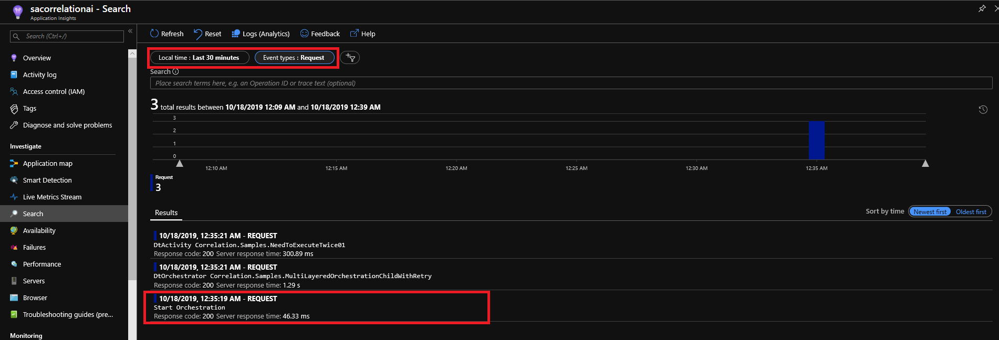

# Getting Started for Distributed Tracing for Durable Functions

In this article, you use command-line tools to create a function app, then publish the sample applications using Visual Studio then learn how to diagnose the telemetry. In this tutorial, we use Azure CLI on the Cloud Shell to create an environment. 

* An Azure account with an active subscription. [Create an account for free](https://azure.microsoft.com/free/?ref=microsoft.com&utm_source=microsoft.com&utm_medium=docs&utm_campaign=visualstudio)
* Visual Studio 2019. Ensure you select the Azure Development workload during installation. For more details [Quickstart: Create your first function in Azure using Visual Studio](https://docs.microsoft.com/en-us/azure/azure-functions/functions-create-your-first-function-visual-studio)


# Create a function app

Go to the [Azure Portal](https://ms.portal.azure.com/), click the cloud shell icon on the right top of the Azure Portal, and select Bash from the dropdown if it's not already selected.


## Create a Resource Group

Run the following commands to create a resource group.

```bash
ResourceGroup=DurableFunctionsQuickstart-rg
Location=westus
az group create --name $ResourceGroup --location $Location
```
## Create a Storage Account

Run the following commands to create a storage account. The storage account name should be globally unique. 

```bash
StorageAccountName=<STORAGE_NAME>
az storage account create --name $StorageAccountName --location $Location --resource-group $ResourceGroup --sku Standard_LRS
```

## Create an Application Insights Resource
FunctionAppName should be globally unique. 

```bash
az extension add -n application-insights
FunctionAppName=<FUNCTION_APP_NAME>
InstrumentationKey=`az monitor app-insights component create --app $FunctionAppName --location $Location --kind web -g $ResourceGroup --application-type web |  jq .instrumentationKey | xargs`
```

`InstrumentationKey` now holds the Application Insights instrumentation key. We'll use this key when we configure the sample app's settings. 

```bash
echo $InstrumentationKey
```

## Create a Function App


```bash
az functionapp create --resource-group $ResourceGroup --consumption-plan-location $Location --runtime dotnet --functions-version 3 --name $FunctionAppName --storage-account $StorageAccountName  --app-insights $FunctionAppName --app-insights-key $InstrumentationKey
```

**NOTE:** The samples target Functions version 3. Distributed Tracing doesn't work for Functions version 1.

# Publish samples 

Run the following commands on your local machine in a terminal of your choice.
These commands will clone the `azure-functions-durable-extension` repository and create a local branch where you can make modifications to local.settings.json and host.json before publishing.

```bash
git clone git@github.com:Azure/azure-functions-durable-extension.git
cd azure-functions-durable-extension
git checkout -b "correlation-sample"
```

## Open the .sln file

Navigate to `samples/correlation-csharp/` then open FunctionAppCorrelation.sln with Visual Studio 2019. 

## Modify local.settings.json

Update the `APPINSIGHTS_INSTRUMENTATIONKEY` value in `local.settings.json` with the `InstrumentationKey` created earlier. 

```json
{
  "IsEncrypted": false,
  "Values": {
    "AzureWebJobsStorage": "UseDevelopmentStorage=true",
    "FUNCTIONS_WORKER_RUNTIME": "dotnet",
    "APPINSIGHTS_INSTRUMENTATIONKEY": "<YOUR_APPINSIGHTS_INSTRUMENTATIONKEY_HERE>"
  }
}
```

## host.json

Configure host.json. The host.json sample below enables Distributed Tracing and sets [W3C Trace Context](https://github.com/Azure/azure-functions-durable-extension/blob/dev/samples/correlation-csharp/reference.md#w3ctracecontext) as the tracing protocol. The default value for `distributedTracingProtocol` is [HttpCorrelationTraceContext](https://github.com/Azure/azure-functions-durable-extension/blob/dev/samples/correlation-csharp/reference.md#httpcorrelationtracecontext).

```json
{
  "version": "2.0",
  "extensions": {
    "durableTask": {
      "tracing": {
        "distributedTracingEnabled": true,
        "distributedTracingProtocol": "W3CTraceContext"
      }
    }
  },
  "logging": {
    "applicationInsights": {
      "httpAutoCollectionOptions": {
        "enableW3CDistributedTracing": true
      }
    }
  }
}
```

## Storage Emulator 
For the local execution, you need the [Storage Emulator](https://docs.microsoft.com/en-us/azure/storage/common/storage-use-emulator). Download it from the link and execute it before you run the functions. 

## Publish the samples to the Function App

Right-click the `FunctionAppCorrelation` project, then select `Publish.`  

Pick a publish target will be `Azure Functions Consumption Plan` with Select Existing with Run from package file. Click `Create Profile`


Then select the target function app. Then click `OK.`



## Run the samples

Refer to the [sample scenarios section](Readme.md#sample-scenario) to find a list of available scenarios and descriptions. Please note that all scenarios are not supported yet. 
To execute samples, call the `HttpStart_*` functions as the endpoints. For example, you can try sending a request to the `/api/HttpStart_SimpleOrchestration` endpoint of your Function App. To run a complex orchestration, try `/api/HttpStart_MultiLayerOrchestrationWithRetry`.

## Diagnose the Telemetry

To see the emitted telemetry, go to the Application Insights resource in the Azure Portal. You can easily find this by going to the `DurableFunctionsQuickstart-rg` resource group. 
Once you have navigated to the Application Insights resource, click `Transaction Search` in the menu. Filter it with `Last 30 minutes` and `Event types: Request.` Click on the `Start Orchestration` request or any request that starts with 'Dt'.



You can see the end-to-end tracing here. Click and see how it correlates with each other. 


**NOTE:** If you see correlation breaks, you might have to wait for the telemetry to propagate to the Application Insights Resource. The request telemetry of the first orchestrator comes last. 

# Next Steps

* [Configuration](configuration.md)
* [Reference](reference.md)
