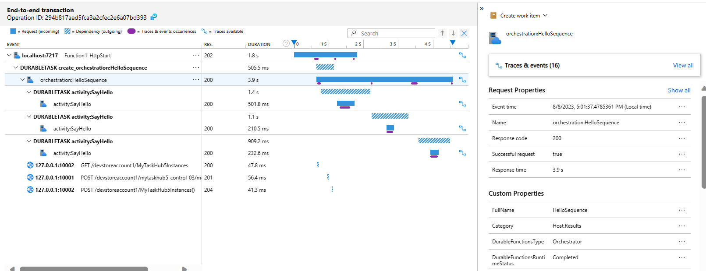
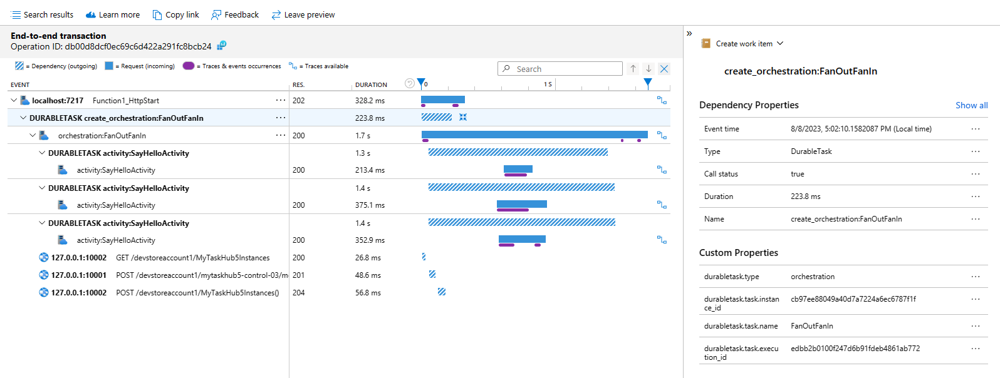
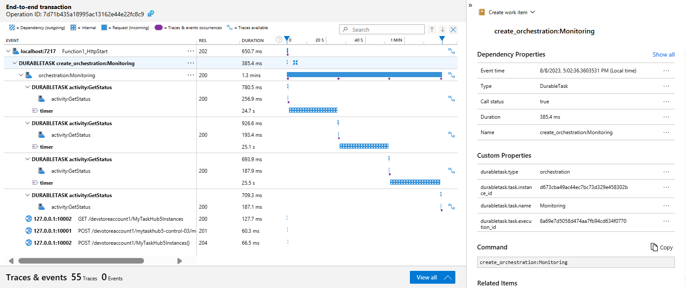
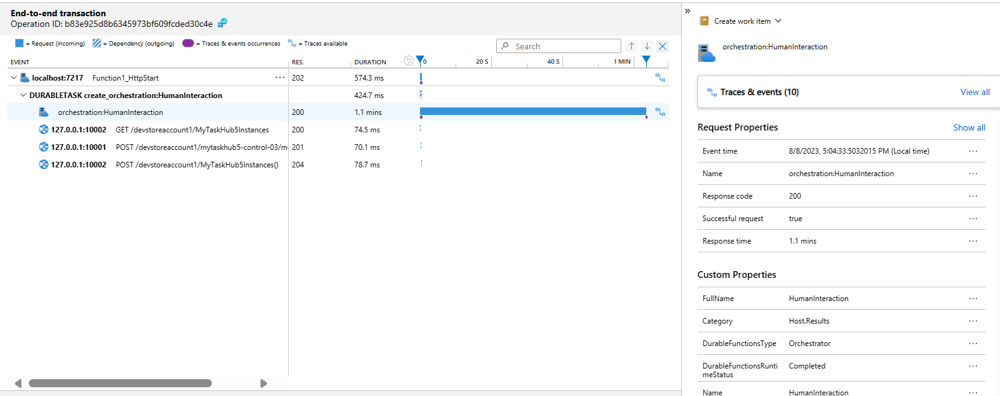
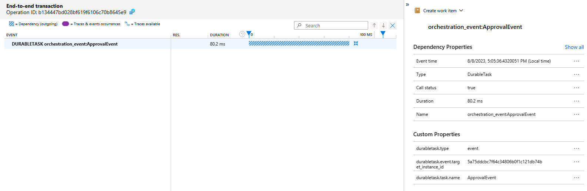

## Distributed Tracing V2 for Durable Functions

The second version of distributed tracing for Durable Functions is in preview.

#### Benefits
1. All three Durable Functions storage providers are supported: Azure Storage, Netherite, and Microsoft SQL Server.
2. It provides additional information in terms of spans and tags.



### Enabling Distributed Tracing V2
To use Distributed Tracing V2, all you will need to do is update your app's host.json and add an environment variable for the Application Insights resource.

#### Update host.json
To use Distributed Tracing V2, please update your host.json settings to include the following settings: `DistributedTracingEnabled` and `Version`. The sample app's host.json is already updated with this information.

```
  "durableTask": {
    "tracing": {
      "DistributedTracingEnabled": true,
      "Version": "V2"
    }
  }
```

#### Add Application Insights
You will also need to specify an Application Insights resource in the environment variables. If you haven't done so already, please follow [these instructions](https://learn.microsoft.com/en-us/azure/azure-monitor/app/create-workspace-resource#copy-the-connection-string) to create an Application Insights resource.

Next, you'll need to copy the connection string or instrumentation key for that resource to add in the environment variables. We recommend adding the `APPLICATIONINSIGHTS_CONNECTION_STRING` environment variable, but you can also add `APPINSIGHTS_INSTRUMENTATIONKEY`. If you are running your app locally, then add this environment variable in `local.settings.json`. If you are running the app in Azure, then add it under `Configuration` as an application setting.

If the Application Insights resource has local authentication disabled, also configure `APPLICATIONINSIGHTS_AUTHENTICATION_STRING`. Use `Authorization=AAD` for the function app's system-assigned managed identity, or `Authorization=AAD;ClientId=<USER_ASSIGNED_CLIENT_ID>` for a user-assigned managed identity. The selected identity needs the `Monitoring Metrics Publisher` role on the Application Insights resource. Microsoft Entra authentication for Application Insights isn't supported by the Functions host during local development.

### Optional host telemetry enrichment

The unreleased `useHostTelemetryInitializers` option lets Durable distributed tracing V2 reuse selected Application Insights initializers registered in the **Functions host**. It defaults to `false`; it is not available merely by selecting V2 in an older extension package.

```json
{
  "version": "2.0",
  "extensions": {
    "durableTask": {
      "tracing": {
        "distributedTracingEnabled": true,
        "version": "V2",
        "useHostTelemetryInitializers": true
      }
    }
  }
}
```

For example, an in-process app can register this initializer in its existing `FunctionsStartup.Configure` method with `builder.Services.AddSingleton<ITelemetryInitializer, ServiceTelemetryInitializer>()` (using `Microsoft.Extensions.DependencyInjection`):

```csharp
using Microsoft.ApplicationInsights.Channel;
using Microsoft.ApplicationInsights.DataContracts;
using Microsoft.ApplicationInsights.Extensibility;

public sealed class ServiceTelemetryInitializer : ITelemetryInitializer
{
    public void Initialize(ITelemetry telemetry)
    {
        telemetry.Context.Cloud.RoleName = "orders-functions";
        if (telemetry is ISupportProperties properties)
        {
            properties.Properties["environment"] = "production";
        }
    }
}
```

With the option off, the initializer enriches host telemetry but not Durable's requests and dependencies. With it on, existing Durable V2 records also receive `cloud_RoleName=orders-functions` and `environment=production`. No additional records are emitted by this integration. A role name identifies the application in Application Insights; it is not an Azure authorization role.

Eligible initializers keep their host order, after Durable's SDK defaults and before its existing operation-name/instance-ID initializer. The host's invocation-context initializer and exact HTTP client-IP initializer are excluded because unrelated ambient context can overwrite Durable names, failure status, or client IP. The default SDK correlation initializer is not added twice. Environment role enrichment and custom initializers are retained, but this does not promise identical role-instance, invocation, or SDK metadata.

Custom initializers remain trusted, mutable SDK code. They must be thread-safe, tolerate repeated initialization, and work without a live HTTP request or function invocation. Deliberate custom operation names are retained and still receive the existing instance-ID suffix when configured. Do not infer Durable-specific identity from ambient HTTP, logging, or activity context.

**Privacy and process boundaries:** Only initializers are reused, not host processors, sampling, filtering, redaction, or `TelemetryClient.Context`. Review any new properties before enabling this option; host redaction processors will not protect Durable records. Initializers registered only in a .NET isolated worker do not participate.

Initializers are selected once at host startup. Restart after changing registrations. The option has no effect with tracing disabled or with V1/None, and logs an explanatory warning. If the host configuration is unavailable, tracing continues without host enrichment and logs a warning. Successful opt-in logs imported/excluded counts.

Enable it in staging first. To roll back, set `useHostTelemetryInitializers` to `false` and restart; previously ingested telemetry is unchanged.

#### Run the sample
The sample shows how Distributed Tracing V2 improves the observability of some flagship Durable Functions patterns.

- Function Chaining


- Fan Out Fan In


- Async HTTP APIs (currently not shown in traces)

- Monitoring


- Human Interation



- Entities (currently not supported)
