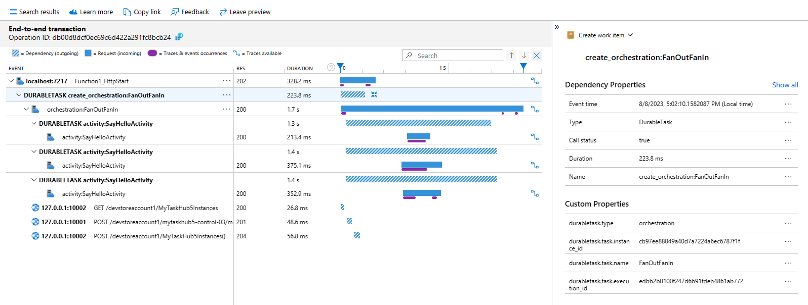

## Distributed Tracing V2 for Durable Functions

The second version of distributed tracing for Durable Functions is in preview.

#### Benefits
1. All three Durable Functions storage providers are supported: Azure Storage, Netherite, and Microsoft SQL Server.
2. It provides additional information in terms of spans and tags.


### Enabling Distributed Tracing V2
To use Distributed Tracing V2, all you will need to do is update your app's host.json and add an environment variable for the Application Insights resource.

#### Update host.json
To use Distributed Tracing V2, please update your host.json settings to include the following settings: `DistributedTracingEnabled` and `Version`. The sample app's host.json is already updated with this information.

```
  "durableTask": {
    "tracing": {
      "DistributedTracingEnabled": true,
      "Version": "V2"
    }
  }
```

#### Add Application Insights
You will also need to specify an Application Insights resource in the environment variables. If you haven't done so already, please follow [these instructions](https://learn.microsoft.com/en-us/azure/azure-monitor/app/create-workspace-resource#copy-the-connection-string) to create an Application Insights resource.

Next, you'll need to copy the connection string or instrumentation key for that resource to add in the environment variables. We recommend adding the `APPLICATIONINSIGHTS_CONNECTION_STRING` environment variable, but you can also add `APPINSIGHTS_INSTRUMENTATIONKEY`. If you are running your app locally, then add this environment variable in `local.settings.json`. If you are running the app in Azure, then add it under `Configuration` as an application setting.

#### Run the sample
The sample shows how Distributed Tracing V2 improves the observability of some flagship Durable Functions patterns.

- Function Chaining


- Fan Out Fan In


- Async HTTP APIs (currently not shown in traces)

- Monitoring


- Human Interation


- Entities (currently not supported)
