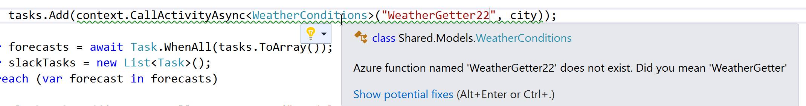
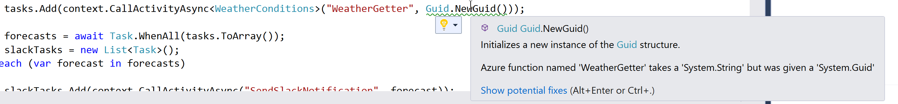
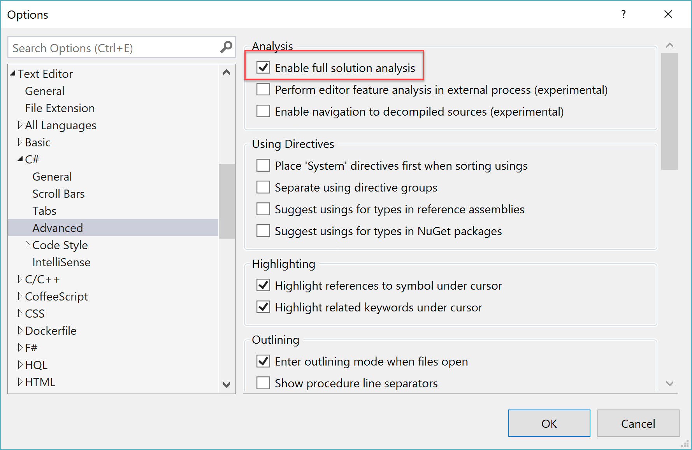

# Durable Functions Analyzer

[](https://dev.azure.com/DurableFunctionAnalyzer/DurableFunctionAnalyzer/_build/latest?definitionId=1)

This is a collection of analyzers to save you from making some common mistakes with [Durable Azure Functions](https://docs.microsoft.com/en-us/azure/azure-functions/durable/durable-functions-overview). 






## The why

Function calls in durable functions are written in a way which can introduce errors in your code which won't be found until run time. In the interests of shifting warnings left these analyzers catch a number of common mistakes.

* Using the wrong name to refer to a function call
* Passing the wrong arguments
* <span style="color: grey">Casting to the wrong return type </span> (not just yet)

## How to use them

The analyzers are distributed as a nuget package. To install it all you need to do is run

```
dotnet add package DurableFunctionsAnalyzer
```

or

```
Install-Package DurableFunctionsAnalyzer
```

You also need to turn on `Enable full solution analysis` to see the warnings in Visual Studio. 




